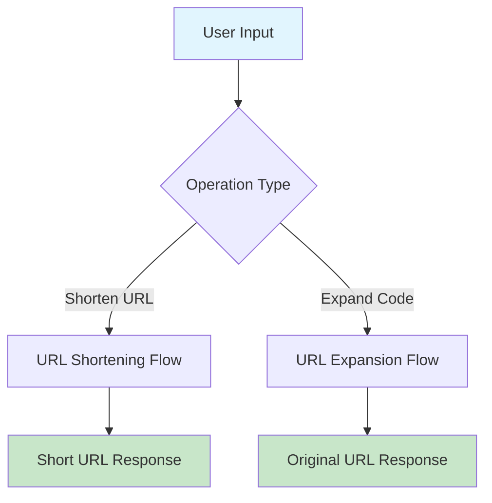
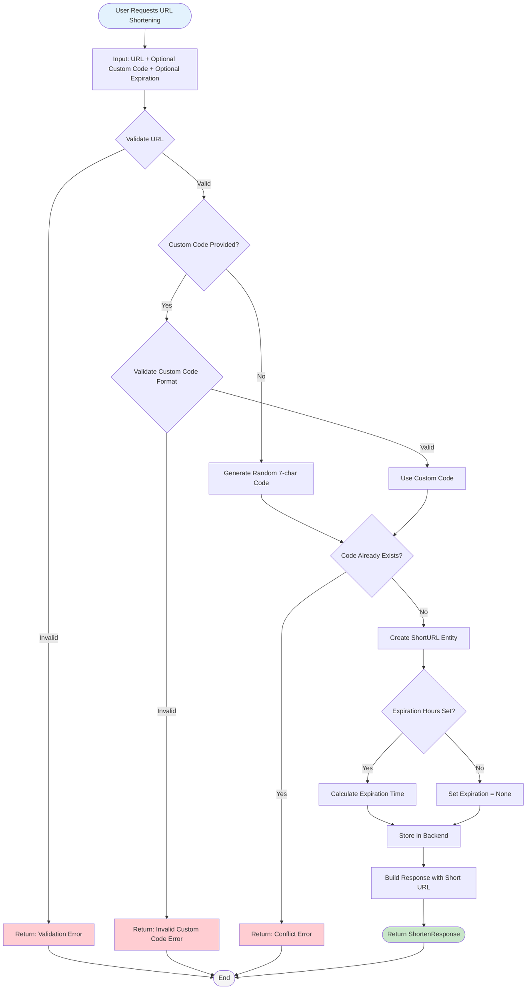
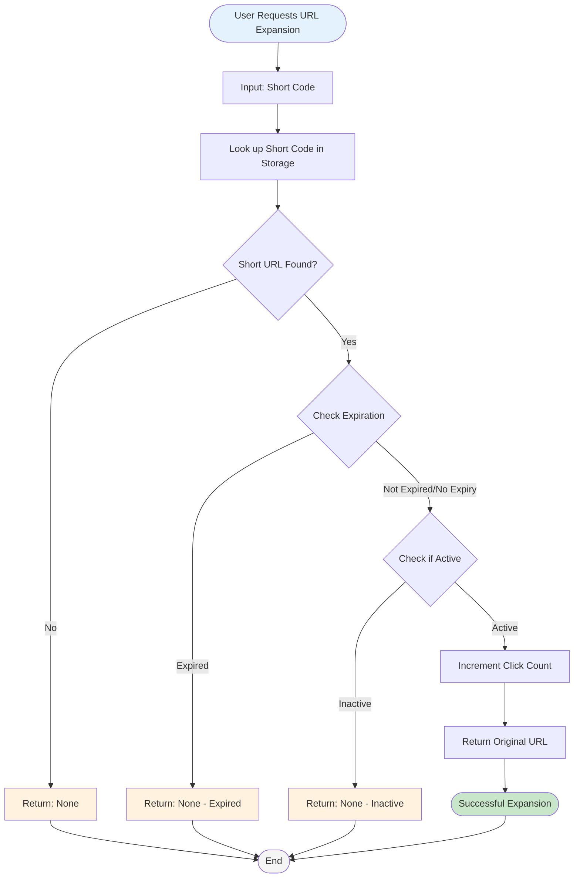
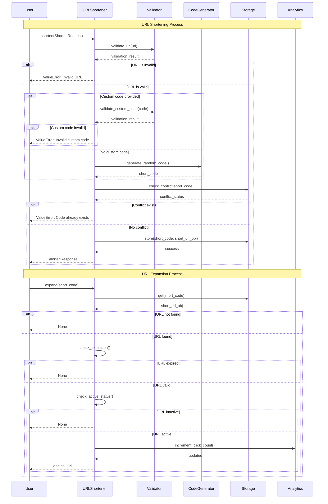
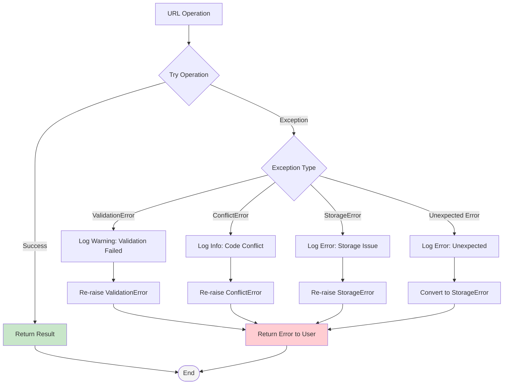
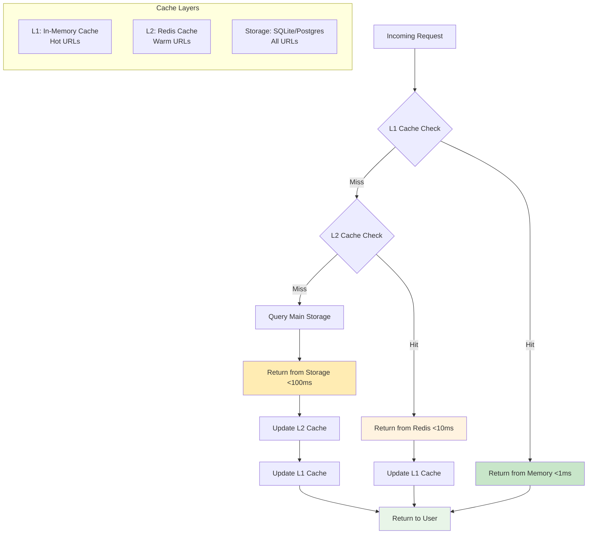
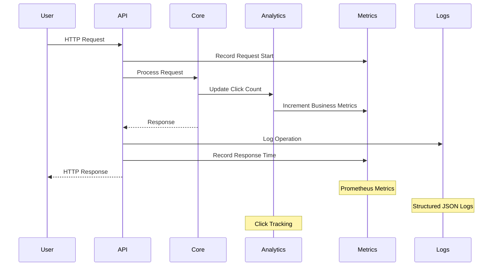
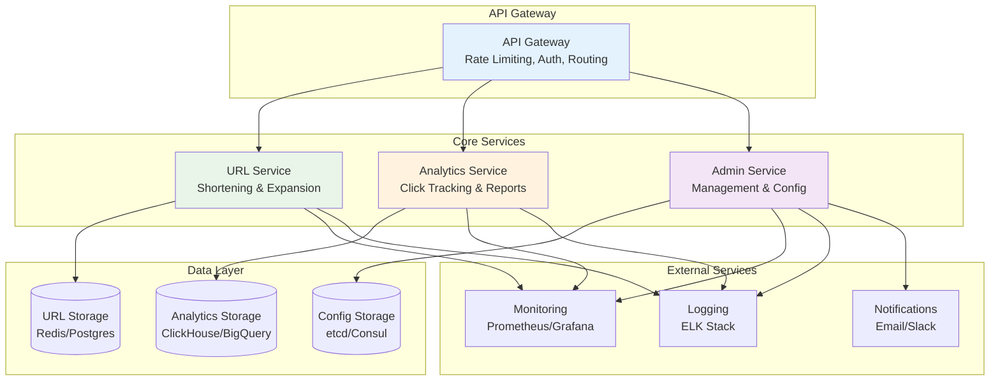
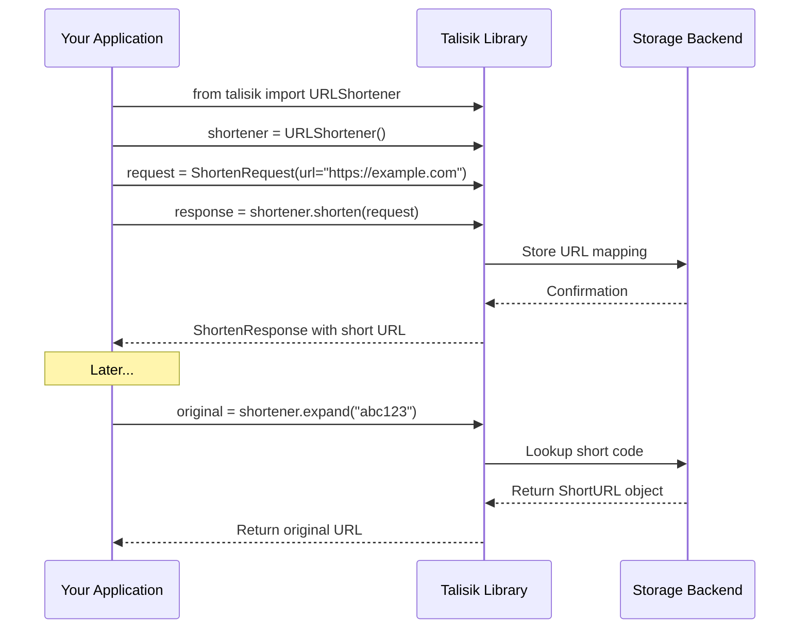

# Talisik Short URL - Workflow Diagrams

This document contains visual representations of how the Talisik Short URL system works, showing the complete workflows for URL shortening and expansion operations.

## Overview Workflow



## URL Shortening Workflow



## URL Expansion Workflow



## Complete System Data Flow



## Storage Backend Architecture Flow

```mermaid
graph TB
    subgraph "Current Implementation"
        A[URLShortener] --> B[In-Memory Dict]
        B --> C[dict[str, ShortURL]]
    end

    subgraph "Planned Architecture"
        D[URLShortener] --> E[AbstractStorage Interface]
        E --> F[MemoryStorage]
        E --> G[SQLiteStorage]
        E --> H[RedisStorage]

        F --> I[dict[str, ShortURL]]
        G --> J[SQLite Database]
        H --> K[Redis Server]
    end

    subgraph "Storage Operations"
        L[get(short_code)] --> M{Storage Type}
        M -->|Memory| N[Dictionary Lookup O(1)]
        M -->|SQLite| O[SQL SELECT Query]
        M -->|Redis| P[Redis GET Command]

        Q[set(short_code, url)] --> R{Storage Type}
        R -->|Memory| S[Dictionary Insert O(1)]
        R -->|SQLite| T[SQL INSERT Query]
        R -->|Redis| U[Redis SET Command]
    end

    style A fill:#e1f5fe
    style D fill:#e1f5fe
    style E fill:#f3e5f5
    style I fill:#c8e6c9
    style J fill:#c8e6c9
    style K fill:#c8e6c9
```

## Error Handling Flow



## Performance and Caching Strategy (Planned)



## Analytics and Monitoring Flow



## Future Microservices Architecture



## Usage Examples

### Basic Library Usage Flow



This comprehensive workflow documentation provides visual representations of all major processes in the Talisik Short URL system, from basic operations to future architectural considerations.
